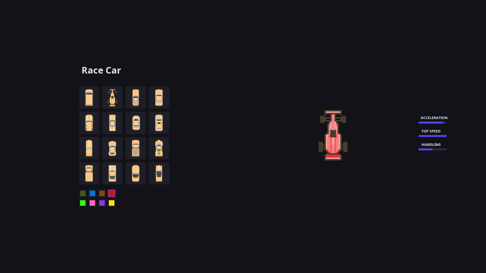
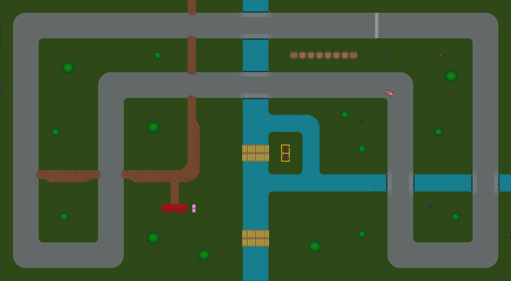

(latest unstable version is at develop)

# RoadFlow - 2D Top-Down Racing Game





## Table of Contents
- [Description](#description)
- [Features](#features)
- [Installation](#installation)
- [Usage](#usage)
- [Controls](#controls)
- [Technical Architecture](#technical-architecture)
- [Contributing](#contributing)
- [License](#license)
- [Acknowledgments](#acknowledgments)

## Description
RoadFlow is a Java-based 2D top-down racing game featuring realistic physics simulation and customizable gameplay elements. Designed for both casual players and programming enthusiasts, the project demonstrates:

- Physics-based vehicle mechanics
- Custom track creation system
- Modular car customization
- Collision detection algorithms

## Features
### Vehicle System
- 16 Unique car types (Sports, Police, SUV, etc.)
- Customizable car colors and physics profiles
- Realistic acceleration and drifting mechanics
- Damage simulation through collision counters

### Track Editor
- Tile-based map creation (60x33 grid)
- Multiple terrain types (road, grass, water)
- Obstacle placement system
- Map file I/O operations

### Game Physics
- Vector-based movement system
- Road surface grip simulation
- Collision response algorithms
- Boundary detection and handling

### UI System
- Interactive stat comparison
- Color customization panel

## Installation
### Requirements
- Java JDK 11+
- Maven 3.6+

### Steps
1. Clone repository:
```bash
git clone https://github.com/yourusername/RoadFlow.git
```
2. Import to IDE as Maven project
3. Build dependencies:
```bash
mvn clean install
```
4. Run main class


## Usage
1. **Car Selection**:
    - Choose from 16 vehicle types
    - Customize color from 8 options
    - Compare performance stats

2. **Track Navigation**:
    - Avoid obstacles (buildings, trees)
    - Stay on road for optimal grip
    - Collect power-ups (future implementation)

3. **Track Editor** (Development):
    - Edit `map.txt` using tile IDs
    - 103 = Start position
    - 6-30 = Road variants
    - Many assets

4. **Gameplay**:
    - Reach finish line to complete track (future implementation)
    - Beat personal best times (future implementation)
    - Compete with AI opponents (future implementation)
    - Two-player mode (future implementation)

## Controls
| Action                | Key                    |
|-----------------------|------------------------|
| Accelerate            | Up Arrow   / W         |
| Brake/Reverse         | Down Arrow    / S      |
| Steer Left            | Left Arrow       / A   |
| Steer Right           | Right Arrow        / D |


## Technical Architecture
```plaintext
src/
├── main/
│   ├── java/
│   │   ├── core/               # Game logic
│   │   ├── physics/            # Collision system
│   │   ├── mechanics/          # Car components
│   │   └── ui/                 # Swing interfaces
│   └── resources/              # Maps and assets
├── test/                       # JUnit tests
```

## Dependencies
- Java Swing (GUI)
- JUnit 4 (Testing)
- Maven (Build)

## Contributing
1. Fork the repository
2. Create feature branch:
```bash
git checkout -b feature/new-cars
```
3. Commit changes following [Java Code Conventions](https://www.oracle.com/java/technologies/javase/codeconventions-introduction.html)
4. Submit pull request

## License
Distributed under MIT License. See `LICENSE` for details.

## Acknowledgments
- Java Swing community
- Oracle Java Documentation
- itch.io for vehicle sprites / assets
